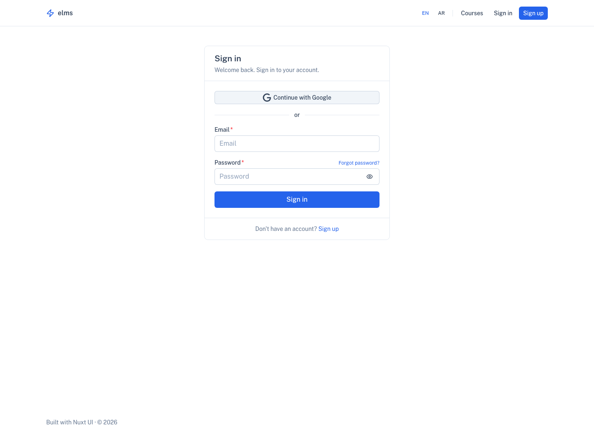
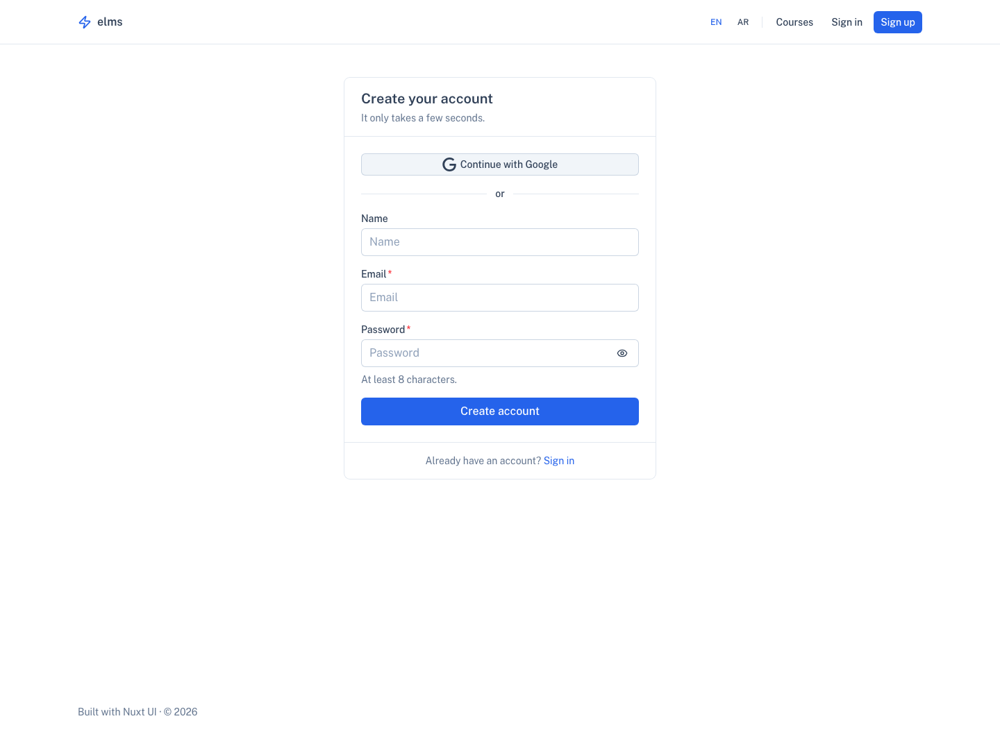
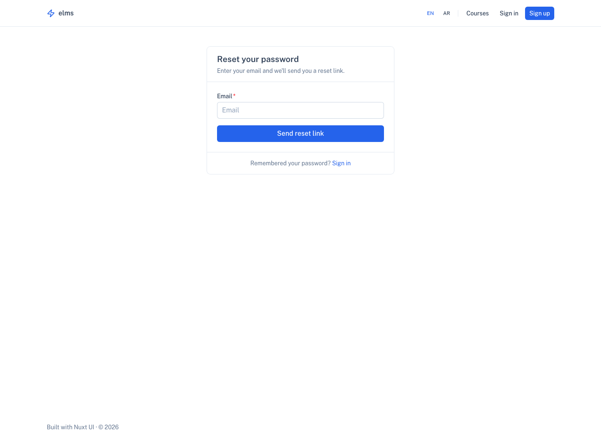
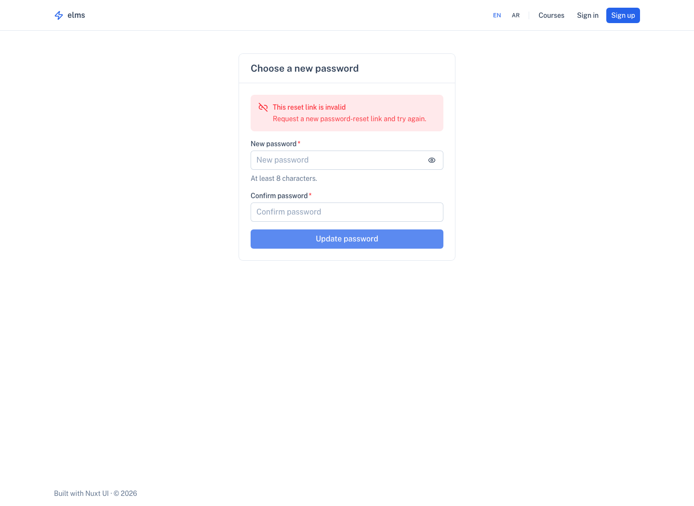
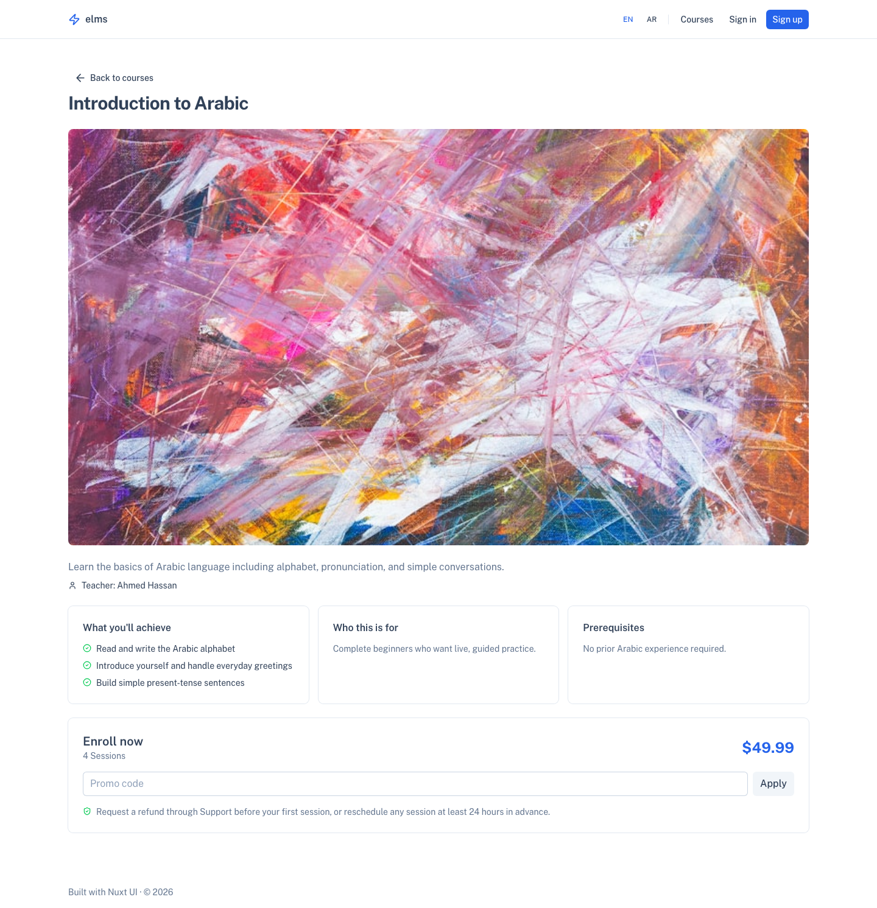
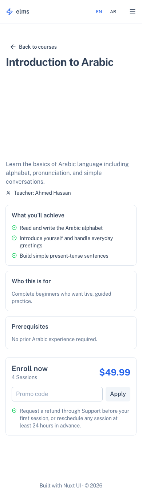
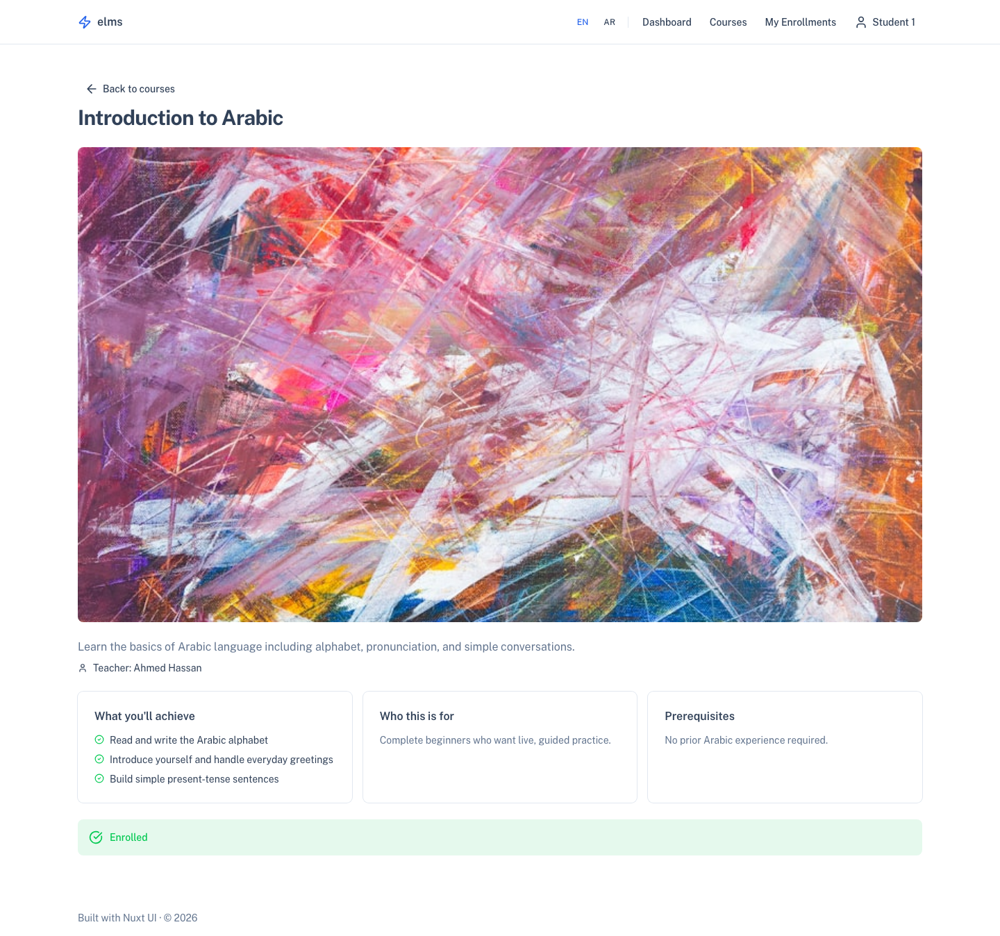
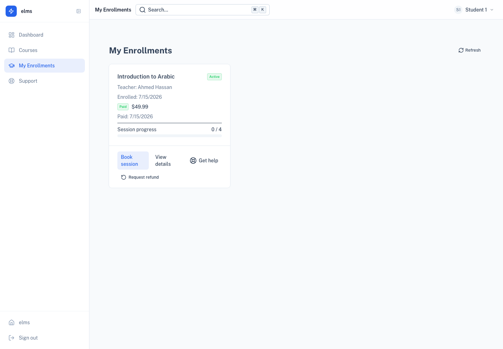
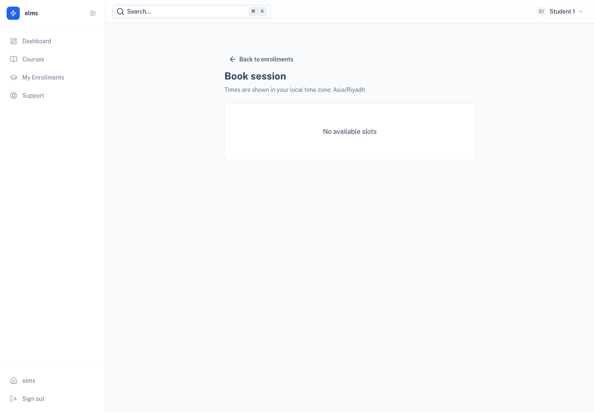
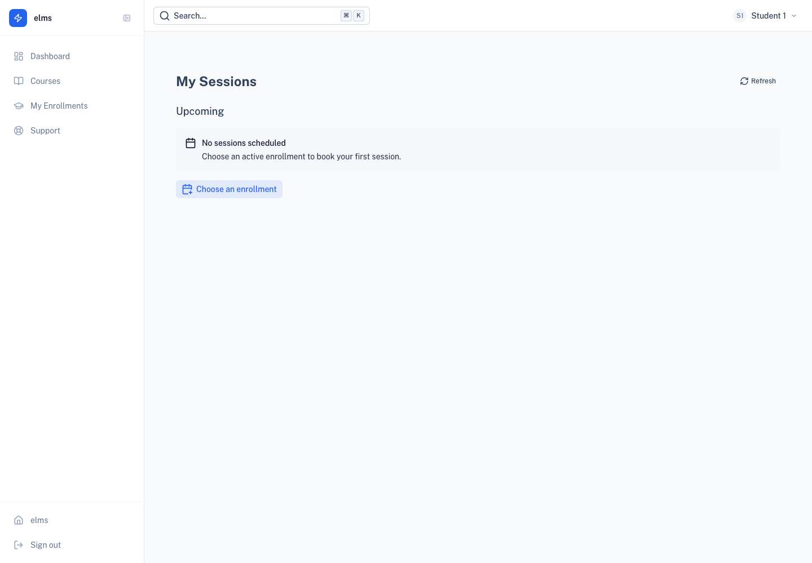

# Student journey market-fit audit

Date: 2026-07-15

## Scope

Student authentication, course purchase, enrollment activation, and one-to-one session booking in the ELMS Nuxt application. Desktop and mobile entry screens were captured locally with realistic seeded data. Lemon Squeezy itself was not captured because local payment credentials are intentionally absent.

## Verdict

The product fits a focused instructor-led course business well. Its strongest differentiator is that course access and scheduled teacher sessions live in the same student account. It should not try to match a broad enterprise LMS yet. The right market position is a bilingual, instructor-led course platform with simple payment and session booking.

The current implementation is suitable for an initial paid pilot after operational configuration of Lemon Squeezy, SMTP, Google OAuth, and production URLs. Cancellation/rescheduling, calendar/video integrations, and support/refund tools remain the main gaps for scaled use.

## Audited journey

1. **Sign in — healthy.** Google and password entry are clear, forgot-password is discoverable, and the intended course is preserved after authentication.

   

2. **Create account — healthy.** The form now asks only for name, email, and password. Time zone is detected automatically; phone, country, and age remain available later in Profile.

   

3. **Password recovery — healthy with operational dependency.** The request does not disclose whether an account exists. Missing reset tokens now produce an explicit recovery message. Delivery still depends on production SMTP.

   

   

4. **Course decision and purchase entry — healthy for a pilot.** Course name, instructor, session count, localized price, promo code, and sign-in handoff are visible. The mobile layout retains the primary purchase action. Sales proof, outcomes, prerequisites, refund terms, and richer curriculum presentation are still thin.

   

   

5. **Paid enrollment state — healthy.** Active students no longer see another checkout. Duplicate active purchases are also rejected server-side.

   

6. **Enrollment hub — healthy.** Payment, teacher, session entitlement, progress, course access, and booking are consolidated. Post-checkout polling now handles the normal webhook delay without falsely claiming instant activation.

   

7. **Book a session — healthy for basic scheduling.** Only server-validated teacher availability is bookable; local time zone is explicit and booking confirmation is emailed. The missing scaled-market capabilities are reschedule/cancel, calendar sync, buffers, minimum notice, and automated reminders.

   

8. **Session follow-up — healthy empty state.** Students have a clear path back to an active enrollment. A mature version should add calendar files, meeting-provider state, rescheduling, cancellation policy, reminders, and post-session follow-up.

   

## Market comparison

| Capability | ELMS now | Market expectation | Fit decision |
| --- | --- | --- | --- |
| Account tied to purchase intent | Yes | Thinkific and Teachable connect enrollment/checkout with account creation | Keep |
| Hosted localized checkout | Lemon Squeezy handoff | Hosted checkout, tax handling, local payment methods | Keep Lemon Squeezy |
| Post-purchase access | Enrollment webhook plus polling | Thank-you state, welcome email, receipt, immediate access | Mostly covered; configure receipt links |
| Course pricing | One-time price per course | Free, one-time, payment plan, subscription | Add only if the business needs it |
| Student billing | Payment status only | Orders, invoices, receipts, billing/refund support | Add an order/receipt link before scale |
| Scheduling | Date-specific availability and collision checks | Invitee time zone, buffers, notice, reminders, reschedule/cancel, calendar sync | Highest remaining product gap |
| Learning progress | Session entitlement progress | Lesson completion and course progress | Add when self-paced content becomes central |
| Bilingual UX | English and Arabic routes/RTL | Locale-aware navigation and checkout | Strong fit; verify hosted checkout Arabic behavior |
| Account security | OAuth, reset, verification, throttling | Strong recovery, abuse controls, optional MFA/passkeys | Adequate pilot baseline |

## Remaining priorities

### Launch-critical configuration

- Configure Lemon Squeezy store, variants, webhook secret, receipt button, confirmation redirect, and test-mode purchase.
- Configure SMTP and confirm verification, password-reset, and session-booking delivery.
- Set `APP_URL` to the production origin and configure Google OAuth redirect URIs.
- Publish refund, cancellation, privacy, and support contact information near checkout.
- Test English, Arabic/RTL, keyboard navigation, focus visibility, zoom/reflow, and screen-reader announcements. Screenshots alone cannot prove WCAG compliance.

### Next product increment

- Student-initiated session cancellation and rescheduling with a configurable cutoff.
- ICS download plus Google/Outlook calendar integration; later add Zoom/Meet provisioning.
- Booking reminders, reconfirmation, no-show follow-up, and teacher notifications.
- Order/receipt history and a direct support path carrying order and enrollment IDs.
- Course outcomes, prerequisites, instructor credibility, refund reassurance, and clearer curriculum depth on the sales page.

### Defer until demand is proven

- Subscriptions and installment plans.
- Bundles, memberships, gifting, affiliates, and order bumps.
- Deep lesson-completion analytics, certificates, communities, and enterprise cohorts.

## Evidence limits

- The hosted Lemon Squeezy checkout, payment methods, taxes, SCA, receipt email, refunds, and webhook delivery were not visually tested because production/test credentials were not present.
- Google OAuth and outbound SMTP were not exercised for the same reason.
- Screenshots cover visible hierarchy and responsive layout; they do not establish full accessibility conformance.

## Market sources

- [Thinkific student experience](https://support.thinkific.com/hc/en-us/articles/360030353834-The-Thinkific-Student-Experience)
- [Teachable student purchase flow](https://support.teachable.com/en/articles/11682431-student-guide-purchase-a-product)
- [Teachable hosted checkout](https://support.teachable.com/en/articles/15646496-customize-your-checkout-page)
- [Calendly time-zone behavior](https://help.calendly.com/hc/en-us/articles/14078163170071-Time-Zones?locale=en-us)
- [Calendly scheduling workflows](https://help.calendly.com/hc/en-us/articles/360051017814-Automate-tasks-with-Workflows?locale=en-us)
- [Lemon Squeezy customer portal](https://docs.lemonsqueezy.com/help/online-store/customer-portal)
- [Lemon Squeezy receipt customization](https://docs.lemonsqueezy.com/help/checkout/customizing-receipt-emails)
